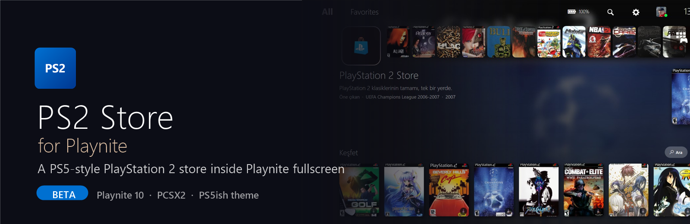
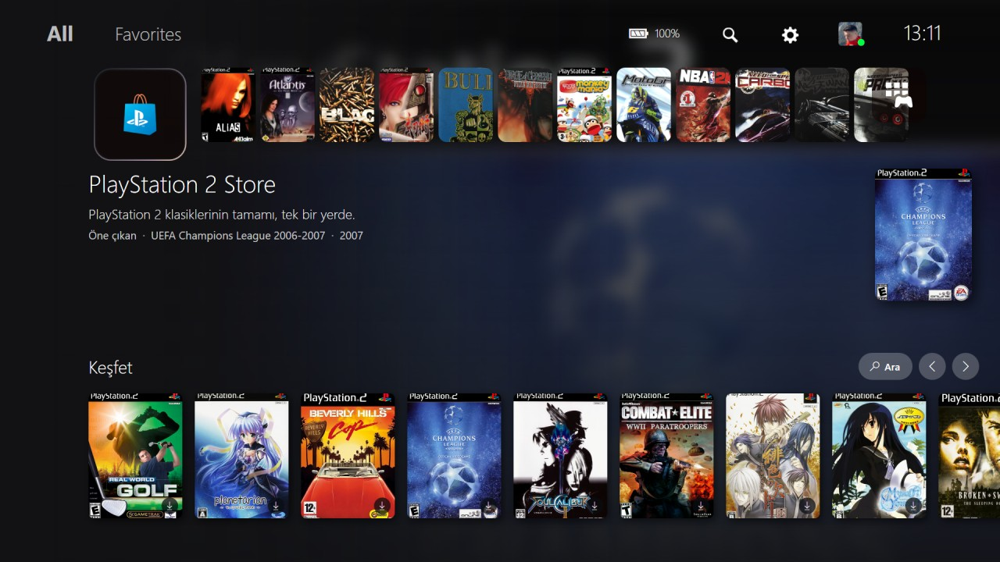
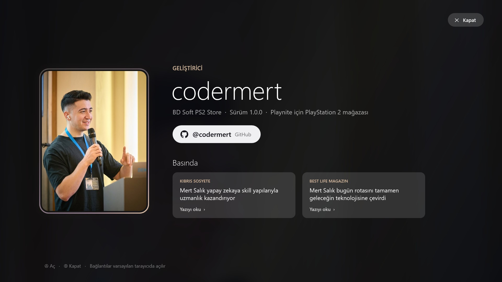

<p align="center"></p>

<h3 align="center">A PS5-style PlayStation 2 store for the Playnite fullscreen mode.</h3>

<p align="center">
  
  
  
  
</p>

> **Beta:** this is the first public beta. Expect rough edges and please report bugs in [Issues](../../issues).

## What is it?

**PS2 Store for Playnite** (BD Soft PS2 Store) is a Playnite extension that turns the PlayStation Store tile of the **PS5ish** fullscreen theme into a real, browsable **PlayStation 2 game catalog**: about 3,900 PS2 games with covers, release year, genre, developer, publisher and descriptions. Search the catalog, favorite games, add them to your Playnite library and link your own game dumps to **PCSX2** in one click.

The store **never downloads games**. You link game files you own.

## Features

- **PS5 Store look:** rotating theme ring on the selected game, hero art, endless random "Discover" row, loading shimmer, theme sounds.
- **~3,900 PS2 games** from open data (Wikidata, PCSX2 GameIndex), covers from the PCSX2 cover collection.
- **Search with abbreviations:** `gta`, `mgs3`, `re4`, `nfs`, `ffx`...
- **On this PC icons:** installed, in library, not on this PC.
- **Add to library** with metadata and cover, **Find game** to link your own ISO/CHD/CSO and set up the PCSX2 play action.
- **"Kur" button** opens a per-game web page (`externalUrl`) you define in `games.json`.
- **Controller, keyboard and mouse** support (tested with an 8BitDo pad).
- **Developer screen** in the Extensions menu.

## Screenshots

<p align="center"></p>
<p align="center"></p>

## Install (3 steps)

1. Install [Playnite](https://playnite.link) 10 and the [PS5ish](https://github.com/davidkgriggs/PS5ish) fullscreen theme.
2. Download the latest `.pext` from [Releases](../../releases) and double-click it (or drag it onto Playnite). Restart Playnite.
3. Click the notification **"PS5ish teması bulundu..."** or open *Extensions → BD Soft PS2 Store → PS5ish temasına entegre et*. Restart Playnite.

Open the PlayStation Store tile in fullscreen mode. To undo the theme changes: *Tema entegrasyonunu geri al* (a backup is kept).

> The UI is in Turkish for now. English UI is on the roadmap.

## Controls

| Where | Controller | Action |
|---|---|---|
| Store tile | Down | go to the games |
| Games | Left / Right | browse (the row never ends) |
| Games | A | actions: Play, Kur, Add to library, Find game, Favorite |
| Games | Up | Search / Discover |
| Anywhere | B | back |

## games.json and the "Kur" button

`%APPDATA%\Playnite\ExtensionsData\9411ebc2-4eeb-439b-84a2-ca7011456b22\games.json` lists every catalog game:

```json
{ "id": "Q822849", "name": "Bully", "platform": "PlayStation 2", "serial": "SLUS-21269", "cover": "", "externalUrl": "" }
```

"Kur" opens `externalUrl` in your default browser (nothing is downloaded or run). Matching is by `id`, then `serial`, then `name`. `cover` overrides the cover. Your values are never overwritten.

## Build from source

No Visual Studio needed (uses the C# compiler that ships with Windows):

```bash
powershell -ExecutionPolicy Bypass -File build.ps1 -PlayniteDir "C:\Path\To\Playnite"
```

Rebuild the catalog: `tools\BuildCatalog.ps1 -GameIndex "<PCSX2>\resources\GameIndex.yaml"`.

## Data and credits

- Game data: [Wikidata](https://www.wikidata.org) (CC0), [PCSX2](https://github.com/PCSX2/pcsx2) GameIndex.
- Covers: [xlenore/ps2-covers](https://github.com/xlenore/ps2-covers). Descriptions: Wikipedia (CC BY-SA).
- Theme: [PS5ish](https://github.com/davidkgriggs/PS5ish) by David Griggs.
- PlayStation is a trademark of Sony Interactive Entertainment. This project is not affiliated with Sony or Playnite.

## Developer

**[@codermert](https://github.com/codermert)**. Press: [Kıbrıs Sosyete](https://www.kibrissosyete.com/haber/mert-salik-yapay-zekaya-skill-yapilariyla-uzmanlik-kazandiriyor-4690), [Best Life Magazin](https://www.bestlifemagazin.com/mert-salik-bugun-rotasini-tamamen-gelecegin-teknolojisine-cevirdi/6124/).

## License

[MIT](LICENSE)